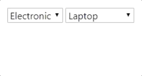

# NetCoreAutoLinkDropdown
## Description
NetCoreAutoLinkDropdown is a package to aid developers in linking several connected dropdowns (parent dropdown with child dropdowns)  
  

## Installation (NuGet)
NetCoreAutoLinkDropdown is a NuGet package and is available to install via nuget.
```
PM> Install-Package NetCoreAutoLinkDropdown
```

## Setup
- First off, install the package in your application:
- Open Startup.cs, add:
  
  ```csharp
  // ConfigureServices
  services.AddTransient<IHttpContextAccessor, HttpContextAccessor>();

  var assembly = typeof(NetCoreAutoLinkDropdown.DropdownProviderControllers.AutoLinkDropdownProviderController).GetTypeInfo().Assembly;
  services.AddMvc().AddApplicationPart(assembly);
  ```

  ```csharp
  // Configure
  app.UseMvc(routes =>
  {
	  routes.MapRoute(
	  name: "default",
	  template: "{controller=Home}/{action=Index}/{id?}");
  });
  ```
  
## Usage
This package consists of

Two main interfaces:
- ```DropdownItem```  
  Your model that will be rendered as dropdown should implement this interface
- ```SubDropdownItemProviderFactory```  
  Implement this in your model if your model also acts as a provider for another dropdown. (For parent dropdowns) 

Helper class:
- ```Dropdown.From(IEnumerable<DropdownItem>)```  
  Converts list of dropdownItems into list of SelectListItems

Tag Helpers:
- ```html
  <auto-dropdown data="IEnumerable<DropdownItem>" id="dropdown-id" asp-for="dropdown-value"></auto-dropdown>
  ```  
  Use this tag helper to render dropdown
- ```html
  <autolink-dropdown provider="parent-dropdown-id" provide-for="subdropdown-id" sub-dropdown-key="provider-data-key"></autolink-dropdown>
  ```   
  Use this tag helper to link parent dropdown to child dropdown(s). To include multiple child, you can use ';' as delimiter in *provider-for*


## Sample Code
Here's a very simple app to demonstrate the usage of this library  
https://github.com/manizer/NetCoreAutoDropdownSample